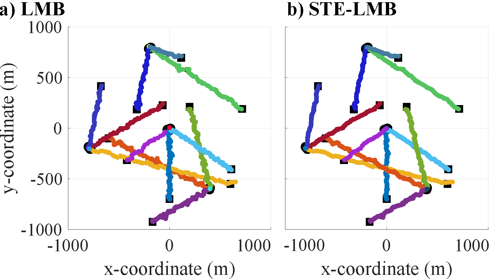

# The Smooth Trajectory Estimator for LMB Filters
This repository is the `MATLAB` codes provided as part of the our ICCAIS 2023 Paper: 
H. V. Nguyen, T. T. D. Nguyen, C. Shim, M. Anuar, "*The Smooth Trajectory Estimator for LMB Filters*", 
in Proc of 2023 ICCAIS, Nov 2023, pp. 1--6. [Paper](assets/STE-LMB_Paper.pdf)\
Below is the comparative result for a linear tracking scenario (Scenario 1 in the paper) between the LMB filter and the STE-LMB filter (our proposed method):



#### Please cite our paper if you are using our codes as follows:
```
@inproceedings{nguyen2023the,
  title={The Smooth Trajectory Estimator for LMB Filters},
  author={Nguyen, Hoa Van and Nguyen, Tran Thien Dat and Shim, Changbeom and Anuar, Marzhar},
  booktitle={Proceedings of the 12th International Conference on Control, Automation and Information Sciences (ICCAIS)},
  year={2023},
  pages={1--6},
  organization={IEEE}
}
```
# Instructions
Run demo.m to run the simulation.\
Uncomment line `30` to run linear dynamic experiment.\
Uncomment line `31` to run non-linear dynamic experiment.
# Acknowledgments
This implementation is based on the [GLMB-Partial-Smoothing](https://github.com/TranThienDat-Nguyen/GLMB-Partial-Smoothing) developed by Dr. Tran Thien Dat Nguyen and the [MATLAB RFS tracking toolbox](http://ba-tuong.vo-au.com/codes.html) provided by Prof. Ba-Tuong Vo.
# Contact
For any queries please contact me at nguyenvanhoa89@gmail.com.
# License
This project is licensed under the MIT License - see the [LICENSE.md](LICENSE) file for details. 